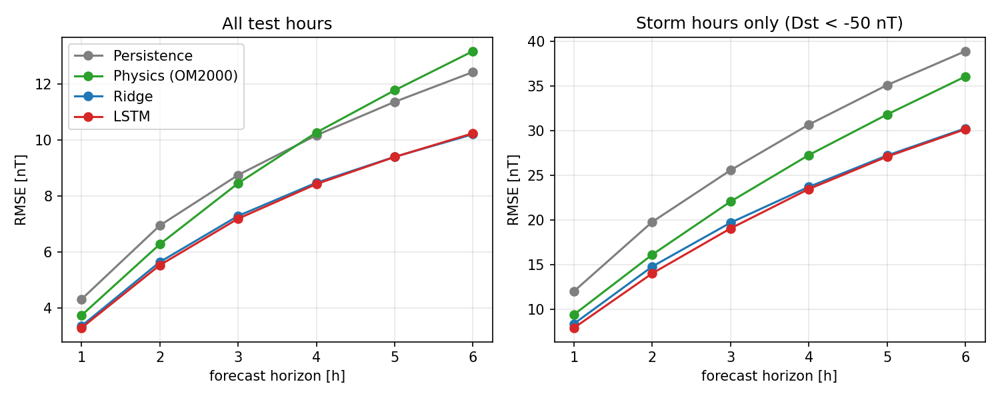

# Forecasting Geomagnetic Storms with Deep Learning

**Multi-hour-ahead forecasting of the Dst index from solar-wind data with an LSTM neural network, benchmarked against a physics-based ring-current model.**


---

## The physics in one paragraph

The solar wind is a magnetised plasma that flows from the Sun at 300–800 km/s. When its magnetic field (the IMF) points **southward** (Bz < 0), it reconnects with Earth's magnetic field at the dayside magnetopause (Dungey cycle). Energy and plasma are loaded into the magnetotail and, after tail reconnection, injected into the inner magnetosphere, where they strengthen the **ring current** that flows westward at 3–7 Earth radii. The magnetic field of the ring current opposes Earth's field at the equator, so a geomagnetic storm appears as a strong **negative** excursion of the **Dst index** (e.g. −412 nT during the May 2024 superstorm). Storms can damage satellites, disturb GNSS positioning and induce currents in power grids, so forecasting them is a practical problem.

## What this project does

Given the last **24 hours** of solar-wind data and Dst, forecast Dst **1 to 6 hours ahead**. Four models are compared on years never used for training (2019–2025, solar cycle 25):

| Model | Idea |
|---|---|
| Persistence | Dst(t+h) = Dst(t). The baseline every forecast must beat. |
| Physics (O'Brien & McPherron 2000) | Burton-type equation dDst*/dt = Q(VBs) − Dst*/τ(VBs), solved analytically with the solar wind frozen at its current value. |
| Ridge regression | Linear model on the full 24-hour input window. |
| **LSTM** | Two-layer Long Short-Term Memory network (≈57k parameters) predicting the *change* of Dst at all horizons at once. |

Key design choices:
- **chronological split** (train 1995–2014, validation 2015–2018, test 2019–2025) with no target leakage across borders;
- only **short gaps (≤3 h) are interpolated**, windows with longer gaps are discarded;
- the network predicts **Δ = Dst(t+h) − Dst(t)**, i.e. a correction to persistence;
- separate metrics for **storm time** (Dst < −50 nT), where forecasts actually matter.

## Results

> Fill this section after running the pipeline: copy the tables from `results/metrics_table.md` and add the figures from `results/figures/`.

**RMSE [nT] on the test set (2019–2025)**

| Model | 1 h | 3 h | 6 h |
|---|---|---|---|
| Persistence | … | … | … |
| Physics (OM2000) | … | … | … |
| Ridge | … | … | … |
| LSTM | … | … | … |




*Discussion:* (2–4 sentences: where does the LSTM beat the physics model? at which horizon? how does it behave during the strongest storm? does it lag the observations?)

## How to run

**Option A - on GitHub, nothing to install.** Go to the *Actions* tab -> *run pipeline* -> *Run workflow*. GitHub downloads the data, trains the LSTM on its own servers (about 20-40 min on CPU), and commits the figures and metrics into `results/`.

**Option B - Google Colab (free GPU).** Open `run_in_colab.ipynb` in Colab, select *Runtime -> Change runtime type -> GPU*, run the cells.

**Option C - on your computer.**

```bash
git clone https://github.com/YOUR_USERNAME/space-weather-dst-forecast.git
cd space-weather-dst-forecast
pip install -r requirements.txt

python 01_download_data.py    # ~30 yearly files from NASA SPDF
python 02_preprocess.py       # cleaning, sliding windows, train/val/test split
python 03_train.py            # trains the LSTM (CPU: ~15-30 min, GPU: ~2 min)
python 04_evaluate.py         # metrics + figures in results/

python -m pytest -q           # unit tests
```

## Repository structure

```
config.py              all settings (years, features, horizons, hyper-parameters)
01_download_data.py    download OMNI2 hourly files
02_preprocess.py       build windows and the train/val/test split
03_train.py            training loop with early stopping
04_evaluate.py         compare all models, make figures
src/
  omni.py              reading the OMNI2 format, fill values -> NaN
  features.py          gap filling, V*Bs, sliding windows, scaler
  baselines.py         persistence, O'Brien-McPherron model, ridge regression
  models.py            the LSTM network (PyTorch)
  metrics.py           RMSE, MAE, correlation, skill score
  plotting.py          all figures
tests/                 unit tests + synthetic OMNI-format data generator
.github/workflows/     tests at every push + the one-click "run pipeline" workflow
```

## Data and acknowledgements

- Solar wind and Dst: NASA/GSFC **OMNI2** hourly data set, [SPDF](https://spdf.gsfc.nasa.gov/pub/data/omni/low_res_omni/) — King, J. H. & Papitashvili, N. E. (2005), *J. Geophys. Res.* 110, A02104.
- The Dst index is produced by the **World Data Center for Geomagnetism, Kyoto**.

## References

- Burton, R. K., McPherron, R. L. & Russell, C. T. (1975). An empirical relationship between interplanetary conditions and Dst. *J. Geophys. Res.* 80, 4204.
- O'Brien, T. P. & McPherron, R. L. (2000). An empirical phase space analysis of ring current dynamics. *J. Geophys. Res.* 105, 7707.
- Hochreiter, S. & Schmidhuber, J. (1997). Long short-term memory. *Neural Computation* 9, 1735.
- Gruet, M. A. et al. (2018). Multiple-hour-ahead forecast of the Dst index using a combination of long short-term memory neural network and Gaussian process. *Space Weather* 16, 1882.
- Camporeale, E. (2019). The challenge of machine learning in space weather: nowcasting and forecasting. *Space Weather* 17, 1166.

## Author

**Tommaso Simionato** — MSc student in Physics (Physics of Matter and Plasma Physics), University of Padua.
